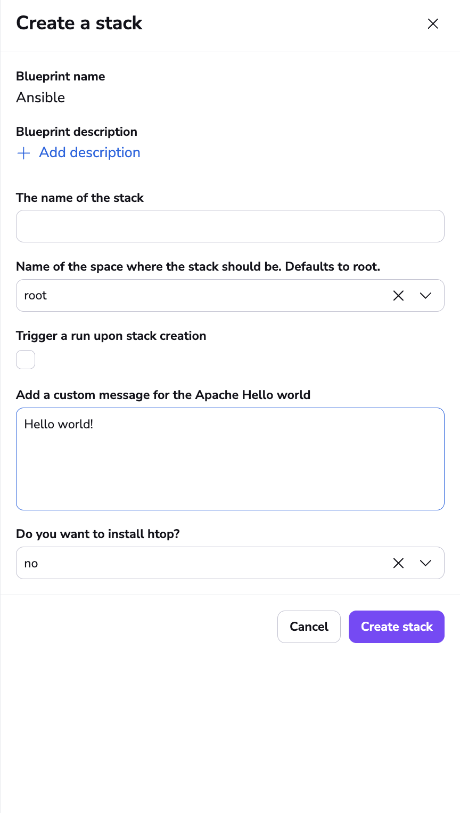

# Spacelift Ansible examples

You can find all examples in the examples directory.

## Ansible with dynamic inventory

This will run a playbook that installs nginx on all of your hosts, only if the free disk space is greater than 10.0GB.

The inventory is build using AWS Dynamic inventory and it will just use the instances with the Env: dev tags, from the eu-west-1 region that are in a running state:

```yaml
plugin: aws_ec2
regions:
  - eu-west-1
filters:
  tag:Env: dev
  instance-state-name: running
```

You will need to modify the integration_id to an integration from your environment.

To override runtime configuration for the free disk space threshold, you can use this:

```yaml
environment:
  SPACELIFT_ANSIBLE_CLI_ARGS: -e disk_space_threshold=2.0
```

## Ansible OpenTofu

This will run a playbook that installs nginx on all of your hosts, only if the free disk space is greater than 10.0GB.

There is a dependency created between the OpenTofu configuration that creates an output of the instances and the Ansible one that receives this output and creates the inventory based on it.

OpenTofu output:

```json
{
  "instance1": {
    "env": "dev",
    "public_dns": "ec2-34-242-60-125.eu-west-1.compute.amazonaws.com"
  },
  "instance2": {
    "env": "dev",
    "public_dns": "ec2-54-195-59-110.eu-west-1.compute.amazonaws.com"
  },
  "instance3": {
    "env": "qa",
    "public_dns": "ec2-18-201-44-222.eu-west-1.compute.amazonaws.com"
  },
  "instance4": {
    "env": "prod",
    "public_dns": "ec2-52-208-55-139.eu-west-1.compute.amazonaws.com"
  }
}
```

Ansible before_init hook that builds the inventory:

```
"echo \"$INSTANCE_JSON\" | jq -r 'to_entries | group_by(.value.env) | .[] as $group | \"[\" + $group[0].value.env + \"]\\n\" + ($group | map(.value.public_dns) | join(\"\\n\")) + \"\\n\"' > /mnt/workspace/ansible_inventory.ini
```

The OpenTofu configuration creates the ssh key, and the key pair for the instances, and then adds the private key into AWS SSM.

The Ansible stack gets the key from SSM before running anything.

You will need to modify the integration_id to an integration from your environment.

To override runtime configuration for the free disk space threshold, you can use this:

```yaml
environment:
  SPACELIFT_ANSIBLE_CLI_ARGS: -e disk_space_threshold=2.0
```

## Ansible blueprint

In this example, you will need to go to Blueprints and select create blueprint and paste the yaml code from the **examples/ansible_blueprint/blueprint.yaml**. You will need to modify the integration_id to an integration from your environment.

Publish the blueprint and then you will be able to create stacks from it:


The playbook installs apache2 on Ubuntu, and based on the inputs you provide, you will customize the message in the **index.html** file. In addition to this, you can also conditionally install htop, by providing yes or no to the **Do you want to install htop** input.
